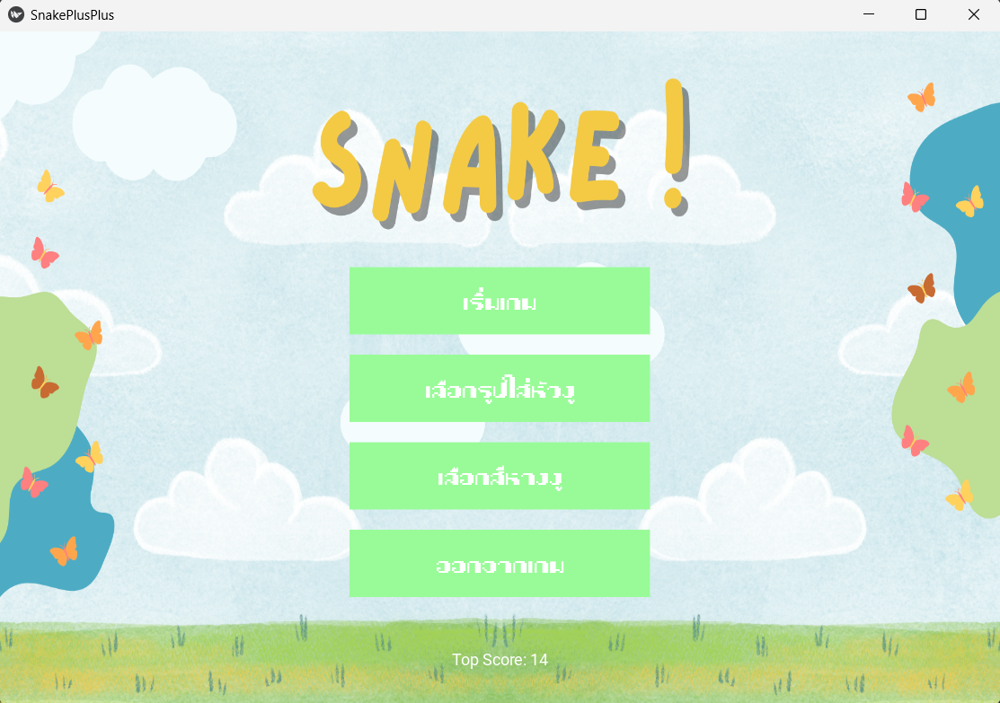
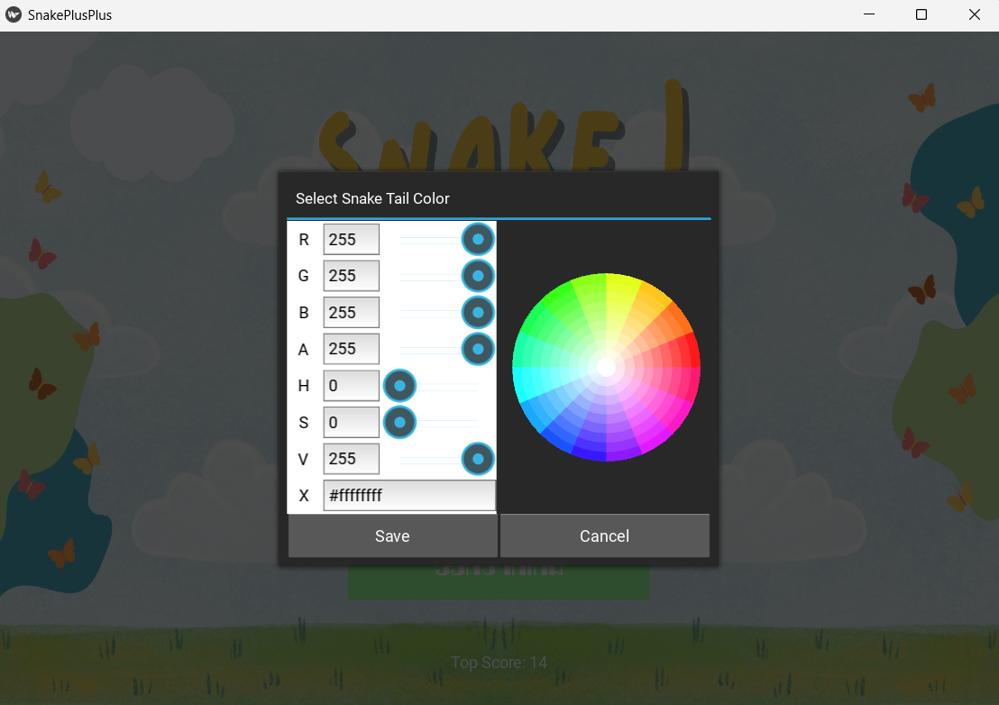
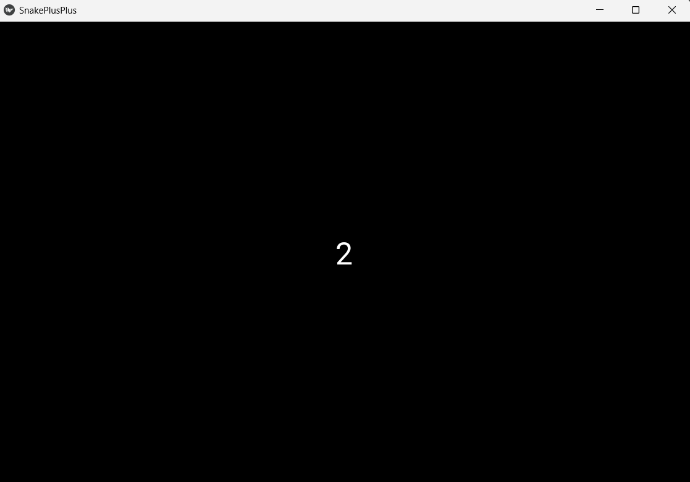
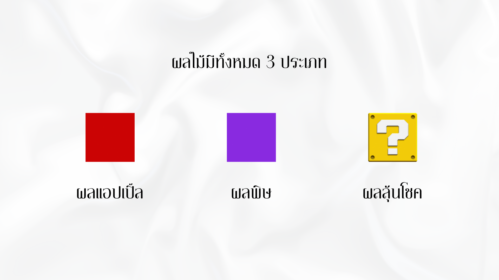
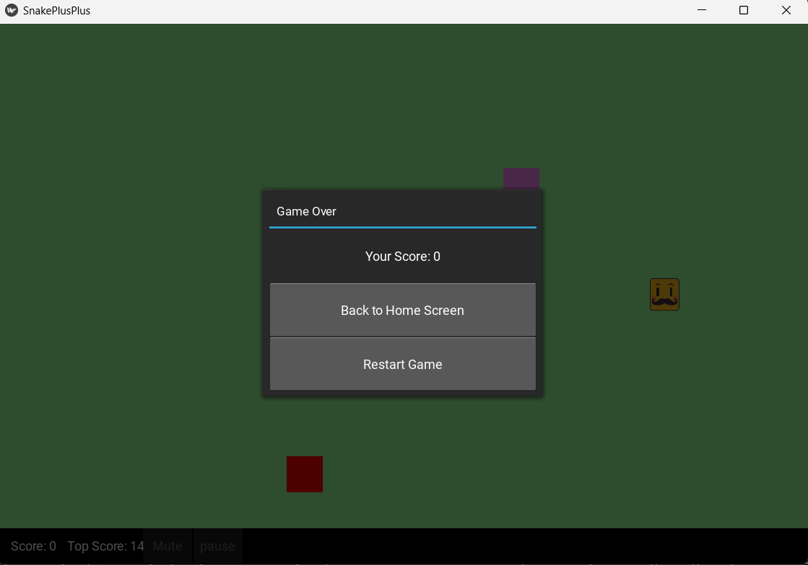

# ภาพรวมการทำงานของโปรแกรม

หลังจากผู้เล่นกด run จะเข้าสู่หน้า home screen

เมื่อผู้เล่นกดเลือกสีหางงู จะขึ้น Color Picker ผู้เล่นสามารถเลือกสีได้ตามต้องการ

เมื่อกดเลือกรูปใส่หัวงู จะขึ้นให้เลือกรูปจากไฟล์ในคอมพิวเตอร์ ผู้เล่นสามารถเลือกรูปภาพได้ตามต้องการ

เมื่อผู้เล่นกดเริ่มเกม จะมีการนับถอยหลัง 3 2 1 Go Go Go

โดยผลไม้มีทั้งหมด 3 ประเภทดังนี้: 
1. ผลแอปเปิ้ล เป็นผลสีแดง (Fruit) 
2. ผลพิษ เป็นผลสีม่วง (Poison Fruit)
3. ผลลุ้นโชค เป็นผลรูปลุ้นโชคสีเหลือง (Lucky Fruit) 

เมื่อเก็บแล้ว:
- ผลแอปเปิ้ล: แต้ม +1, หาง +1
- ผลพิษ: แต้ม -3, หาง +3
- ผลลุ้นโชค: ลุ้นคะแนนระหว่าง -5 ถึง +5, ลุ้นหางระหว่าง -5 ถึง +5

ระบบจะมีการเก็บคะแนนที่เล่นได้ในแต่ละรอบ และมีการเก็บคะแนนสูงสุดที่ทำได้

และเมื่อชนขอบหน้าจอ, งูชนหางตัวเอง, ชนกับผลพิษหรือผลลุ้นโชค จนทำให้คะแนน น้อยกว่า 0 จะทำให้งูตาย 
จะมี popup gameover แสดงขึ้นมา โดยแสดงคะแนนและมีปุ่มสองปุ่ม

- ปุ่ม Back to Home Screen เพื่อกลับไปหา home screen
- ปุ่ม Restart game เพื่อเริ่มเล่นเกมใหม่
  
